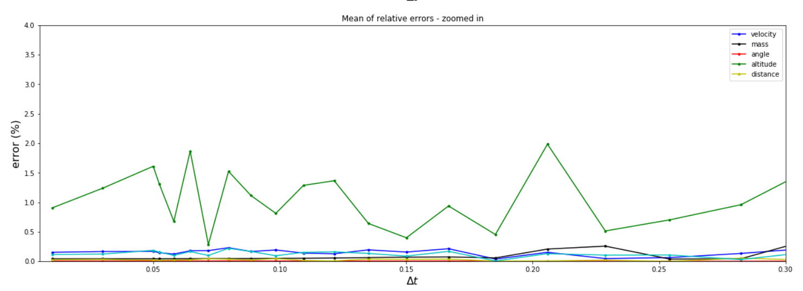
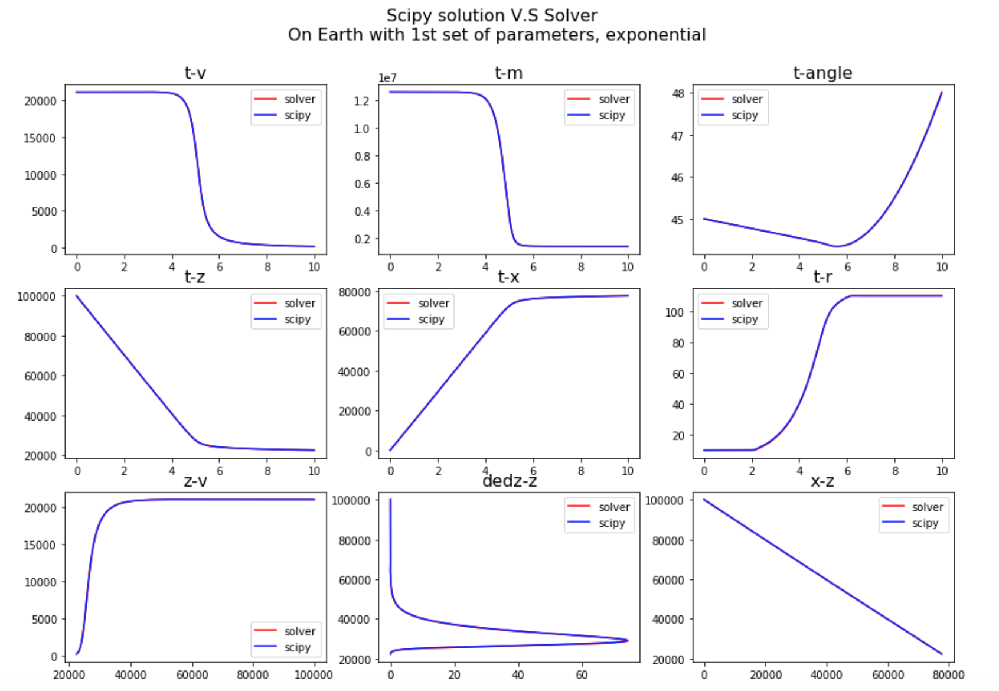
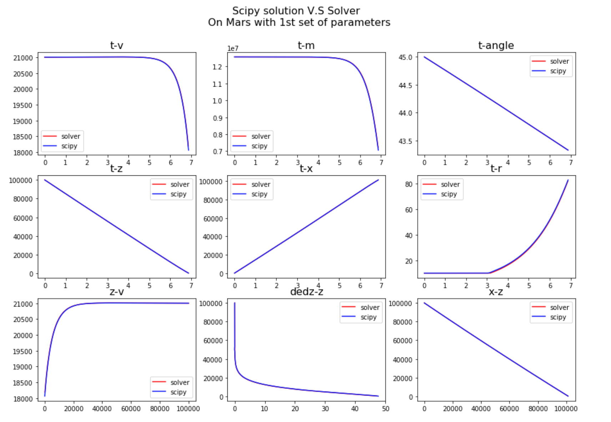
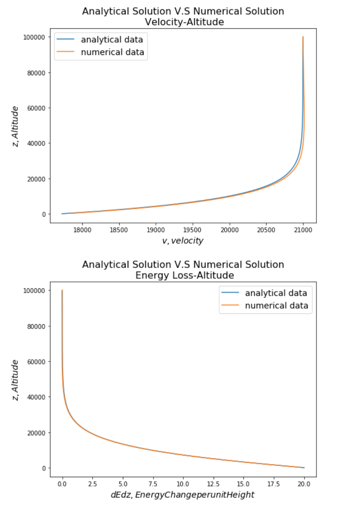

Project 2: Armageddon - Atmospheric entry and disruption of asteroids
=====================================================================

Synopsis:
---------

Asteroids entering Earth’s atmosphere are subject to extreme drag forces
that decelerate, heat and disrupt the space rocks. The fate of an
asteroid is a complex function of its initial mass, speed, trajectory
angle and internal strength.

`Asteroids <https://en.wikipedia.org/wiki/Asteroid>`__ 10-100 m in
diameter can penetrate deep into Earth’s atmosphere and disrupt
catastrophically, generating an atmospheric disturbance
(`airburst <https://en.wikipedia.org/wiki/Air_burst>`__) that can cause
`damage on the ground <https://www.youtube.com/watch?v=tq02C_3FvFo>`__.
Such an event occurred over the city of
`Chelyabinsk <https://en.wikipedia.org/wiki/Chelyabinsk_meteor>`__ in
Russia, in 2013, releasing energy equivalent to about 520 `kilotons of
TNT <https://en.wikipedia.org/wiki/TNT_equivalent>`__ (1 kt TNT is
equivalent to :math:`4.184 \times 10^{12}` J), and injuring thousands of
people (`Popova et al.,
2013 <http://doi.org/10.1126/science.1242642>`__; `Brown et al.,
2013 <http://doi.org/10.1038/nature12741>`__). An even larger event
occurred over
`Tunguska <https://en.wikipedia.org/wiki/Tunguska_event>`__, an
unpopulated area in Siberia, in 1908.

The purpose of this exercise is to develop a fast numerical simulator to
predict the fate of asteroids entering Earth’s atmosphere for the
purposes of hazard assessment.

Problem definition
------------------

Equations
~~~~~~~~~

The dynamics of an asteroid in Earth’s atmosphere is
governed by a coupled set of ordinary differential equations:

.. math::
   :nowrap:

   \begin{aligned} 
   \frac{dv}{dt} & = \frac{-C_D\rho_a A v^2}{2 m} + g \sin \theta \\
   \frac{dm}{dt} & = \frac{-C_H\rho_a A v^3}{2 Q} \\
   \frac{d\theta}{dt} & = \frac{g\cos\theta}{v} - \frac{C_L\rho_a A v}{2 m} - \frac{v\cos\theta}{R_P + z} \\
   \frac{dz}{dt} & = -v\sin\theta \\
   \frac{dx}{dt} & = \frac{v\cos\theta}{1 + z/R_P}
   \end{aligned}

In these equations, :math:`v`, :math:`m`, and :math:`A` are the asteroid
speed (along trajectory), mass and cross-sectional area, respectively.
:math:`\theta` is the meteoroid trajectory angle to the horizontal (in radians), :math:`x` is the
downrange distance of the meteoroid from its entry position, :math:`z`
is the altitude and :math:`t` is time; :math:`C_D` is the drag
coefficient, :math:`\rho_a` is the atmospheric density (a function of
altitude ), :math:`C_H` is an ablation efficiency coefficient, :math:`Q`
is the specific heat of ablation; :math:`C_L` is a lift coefficient; and
:math:`R_P` is the planetary radius. All terms use MKS units.

It is common to assume (for simplicity) that, prior to break-up, the
radius (and cross-sectional area) of the asteroid remains constant;
that is, any mass-loss by **ablation** does not change the
cross-sectional area of the asteroid. We will further assume a spherical asteroid. 

A commonly used criterion for the break-up of an asteroid in the
atmosphere is when the ram pressure of the air interacting with the
asteroid :math:`\rho_a v^2` first exceeds the strength of the asteroid
:math:`Y`.

.. math:: \rho_a v^2 = Y

Should break-up occur, the asteroid deforms and spreads laterally as
it continues its passage through the atmosphere. As a result its
radius and cross-sectional area increase, but the asteroid density is
assumed to remain constant (often referred to as 'pancaking').  It is
conventional to define the cross-sectional area of the expanding cloud
of fragments as :math:`A = \pi r^2` (i.e., assuming a circular
cross-section), for use in the above equations.

Several models for the spreading rate :math:`\frac{dr}{dt}` have been proposed. In the
simplest model, the fragmented asteroid’s spreading rate is related to
its along trajectory speed `(Hills and Goda, 1993) <http://doi.org/10.1086/116499>`__:

.. math::  \frac{dr}{dt} = \left[\frac{7}{2}\alpha\frac{\rho_a}{\rho_m}\right]^{1/2} v

Where :math:`r` is the asteroid radius, :math:`\rho_m` is the asteroid
density and :math:`\alpha` is a spreading coefficient, often taken to be
0.3.

Note that fragmentation and spreading **ceases** (:math:`\frac{dr}{dt}
= 0`) when the ram pressure drops back below the strength of the
asteroid :math:`\rho_a v^2 < Y`.

The figure below shows a typical solution to the above set of equations
for an impact airburst scenario. The kinetic energy loss per unit
height, which is a good approximation for the energy transferred to the
atmosphere as heat (and is often referred to as the energy deposited per
km altitude), is shown as a function of altitude.

.. image:: ../images/airburst.png

In this scenario the asteroid experiences breakup at approximately 48-km altitude (denoted by the star), before spreading and decelerating rapidly until an altitude of approximately 15 km at which point the **energy loss per unit height** is **maximum**. This point is often considered to be the **burst altitude**. The total kinetic energy lost by the asteroid at this point is a good estimate of the airburst energy (i.e., the total energy deposited into the atmosphere) for hazard analysis.

Impact scenarios with a burst altitude well (>5 km) above the surface can be considered to be **airburst events** and are unlikely to form a sizable crater on the ground. In such cases, even if a substantial fraction of the original asteroid survives to the ground it will be decelerated to a very small fraction of its initial speed.

Impact scenarios with a burst altitude below the surface (i.e., peak energy deposition per unit height is not reached before the asteroid strikes the ground) will form a sizable impact crater on the ground and can be considered as a **cratering event** (although a sizable proportion of the original kinetic energy of the asteroid may be transferred to the air).

Between these scenarios is a complex regime where a **low altitude airburst combined with a substantial crater-forming event** is likely. This regime is not well understood.

Solver
------

Solve atmospheric entry
~~~~~~~~~~~~~~~~~~~~~~~

For our solver ``solve_atmospheric_entry`` we decided to create an array of all the initial conditions (``u0``).

``f_ode`` is a function that sets up the ordinary differential equations (ODEs) to be solved using the values of ``u``. It also ensure the radius of the asteroid remains constant unless the strength Y is overcome (rho_a v^2 > Y). It returns an array ``val`` of equations to be solved.

``RK4`` is a function that uses the Runge-Kutta 4 method to solve the ODEs. It sets up arrays ``u`` and ``t``, to use when ``f_ode`` is called and ``u_all`` and ``t_all`` to store the solutions for each timestep. After each timestep ``u_all`` and ``t_all`` is appended and the new values of ``u`` and ``t`` are used in the next timestep. Once ``t`` overcomes ``t_max``, the solver stops and returns ``u_all``, ``t_all``, all the solution values for each timestep.

The ``solve_atmospheric_entry`` function returns a dataframe containing all this data.

Calculate Energy
~~~~~~~~~~~~~~~~

This function uses the result from ``calculate_atmospheric_entry`` to calculate the kinetic energy lost per unit altitude.

Using the equation:

.. math:: E = \frac{1}{2}mv^2

This is then divided by the altitude and added as a column in the datframe.

Analyse Outcome
~~~~~~~~~~~~~~~
This analyses our previous results and returns a dictionary with details of an an airburst and/or cratering event.

There are 3 possible scenarios described above. Using ``if`` statements different information will be output depending on the scenario. For an airburst the burst altitude, its peak energy per unit alttitude and the total kinetic energy lost will be returned. For a cratering event the impact time, mass and speed will be returned. And for an airburst and cratering event, all the information will be returned.

Options
~~~~~~~

The default atmosphere of the solver is set to ``exponential``. This can however be set to ``tabular`` ``mars`` or ``constant``. The solver will then change the fuction it uses to calculate :math:`\rho_a`, to reflect the atmosphere desired.

RK4 Algorithm
~~~~~~~~~~~~~
To solve our problem numercally, the Runge-Kutta 4 method was used. It computes the next :math:`y_n+1` value (our ``u``) by using the current :math:`y_n` plus a weighted average of 4 increments, as the equations below describe.

.. math::
   :nowrap:

   \begin{aligned}
   k_1 & = dtf(t_n,y_n) \\
   k_2 & = dtf(t_n+\frac{dt}{2},y_n+\frac{k_1}{2}) \\
   k_3 & = dtf(t_n+\frac{dt}{2},y_n+\frac{k_2}{2}) \\
   k_4 & = dtf(t_n+h,y_n+k_3) \\
   y_n+1& = y_n+\frac{1}{6}(k_1+2k_2+2k_3+k_4) \\
   t_n+1& = t_n + dt \\
   \end{aligned}

Accuracy of our Solution
~~~~~~~~~~~~~~~~~~~~~~~~

Below show plots of the % errors on our solution for each timestep. The first figure is with fragmentation, i.e. and airburst, and the second without, i.e. cratering.

        Error vs timestep with fragmentation

.. figure:: withoutfrag.png
        :width: 500px
        :align: center
        :alt: alternate text
        :figclass: align-center

        Error vs timestep without fragmentation

As can be seen from the figures the errors are fairly consistent apart from the altitude. However the error margin is very small overall, less than 2.5% with fragmentation and less than 0.004% without.

The following 2 plots show comparisons of our solver vs scipy tests. As can be seen the solution matches extremely well.

        Plots of numerical vs Scipy solution used in testing (Earth)

        Plots of numerical vs Scipy solution used in testing (Mars)

The final figure shows with the analytical solution, which also shows a very good match

        Plots of numerical vs analytical used in testing 

Function API
============

.. automodule:: armageddon
  :members:
  :imported-members:

